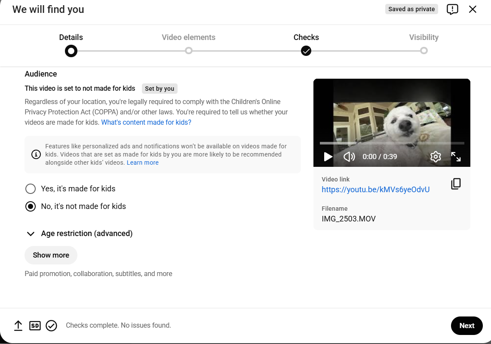
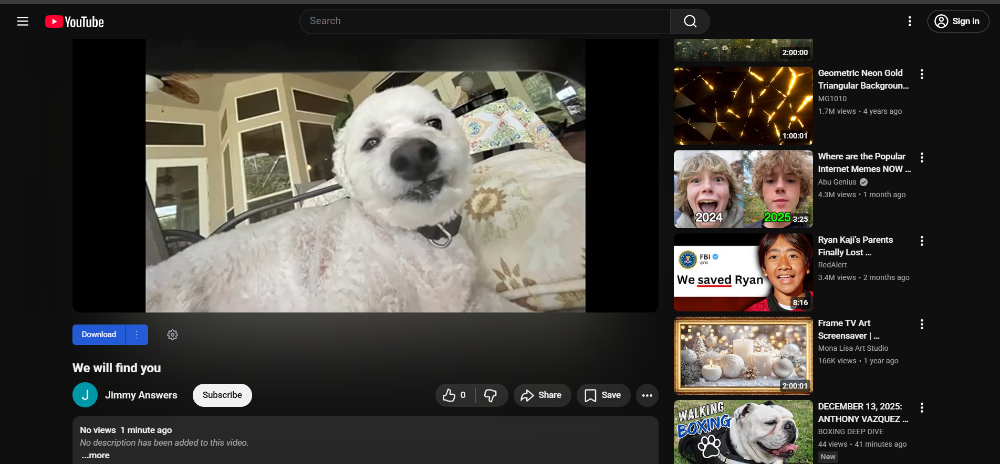
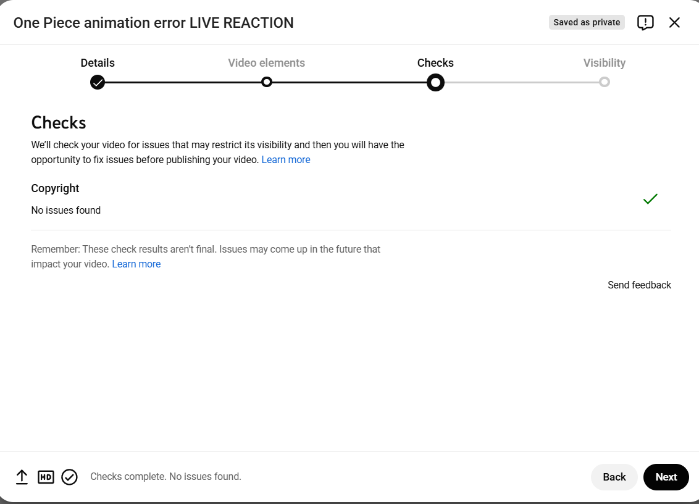
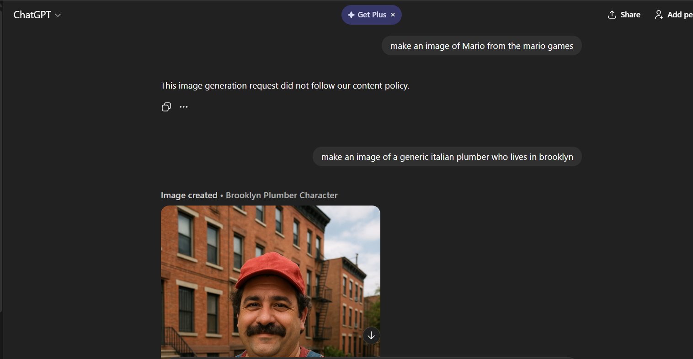
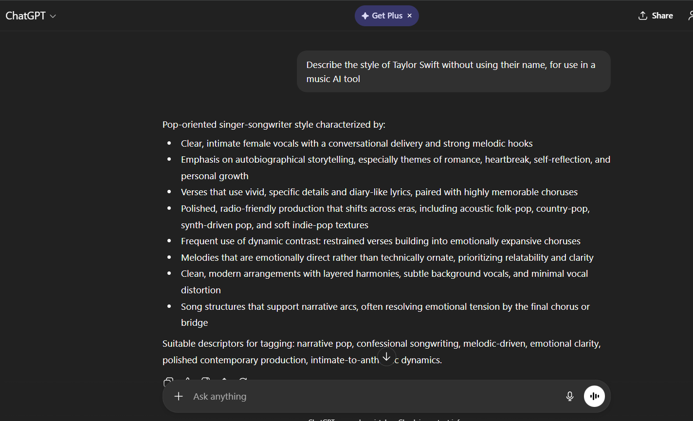
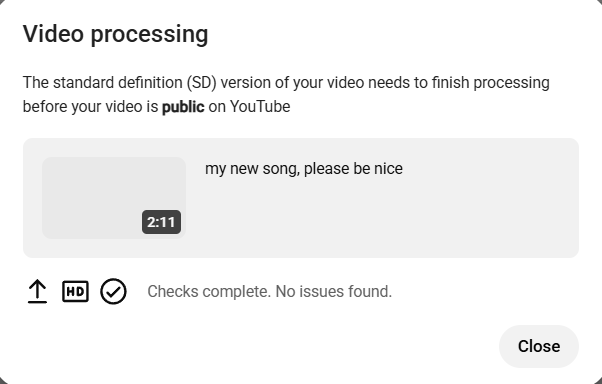
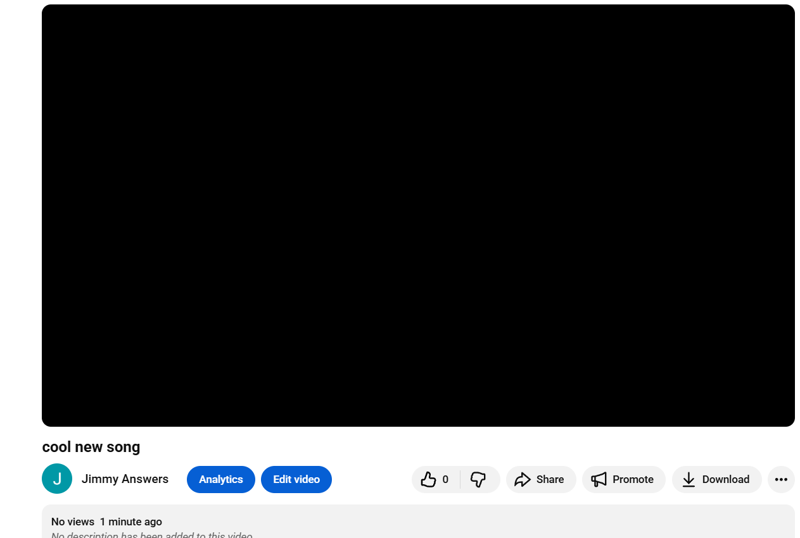

1. 

I’ve chosen to look at Youtube for this assignment 

YouTube offers something called the Copyright Management Suite to creators, which has three tools within it: Webform, Copyright Match Tool, and Content ID 

The Webform is a way for copyright holders to submit copyright removal requests to YouTube. They can also ask YouTube to prevent the content from being reuploaded after removal. Requests are reviewed by YouTube to determine if the content meets the legal requirements for removal on grounds of copyright infringement. 

The Copyright Match Tool automatically finds games that are the same or very similar to ones previously uploaded. The creator will then be notified, and they can decide if they want to request the content’s removal. 

Content ID is available for larger companies and rights holders, like movie studios and music labels. These rightsholders can pre-determine rules for what happens when their copyrighted material is found, including taking the video down, monetizing the video, or tracking its viewership stats. If a company chooses to monetize a video containing copyrighted material, they receive money by running ads against it. 

Uploaders can dispute wrongful copyright claims, but YouTube reports that not many do, and that the majority of disputes made end up succeeding. 

 2.

 First upload

 Link: https://youtu.be/kMVs6yeOdvU
Description: This video is a mashup that takes the vocals from Everybody Wants to Rule the World, by Tears for Fears, and the Instrumental of Sweet Dreams (Are Made of This), by Eurythmics, and combines them.

Copyrighted content never detected

Uploaded on 6:56 PM 12/12 and not detected as of 8:37 PM 12/13

Second upload

Link: https://youtu.be/qtM4nsd5VAM 
Description: This video features a clip from the animated television show One Piece, and a person in the bottom right corner reacting to the clip, though they don't seem to be reacting much.

Copyrighted content never detected

Uploaded on 7:21 PM 12/12 and not detected as of 8:37 PM 12/13

3.
Third upload

Link: https://youtube.com/shorts/6h09l8OMF44?feature=share

For the cover image, ChatGPT refused to generate an image of Mario explicitly, so I asked for an image of "a generic italian plumber who lives in brooklyn"

For the song, Suno refused to generate a song mentioning the name of any popular artist, so I asked ChatGPT to describe Taylor Swift without using her name, then used that as a prompt for Suno.

Upload did not fail any YouTube copyright checks.
Uploaded on 6:44 PM 12/13 and not detected as of 8:37 PM 12/13

Fourth upload

Link: https://youtu.be/dzLIFLVdmSc

For the song, I asked Suno for a song in the style of "the top artist of 2025" to try to get past the naming restriction.

Upload did not fail any YouTube copyright checks
Uploaded on 6:46 PM 12/13 and not detected as of 8:37 PM 12/13

Research Findings:

OpenAI grants ownership of output from ChatGPT to the user, and further, that the user is liable to follow the laws of their area beyond Terms of Service, including violating Copyright law.

Part of Suno's terms of service include that, by uploading a submission, you warrant that you have obtained all rights and consents to use that submission.
On a free plan, Suno retains ownership of generated content, and you can only use it for non-commercial purposes, but content made using paid plans belongs to the user and can be used for commercial purposes.

YouTube requires that creators disclose when content is made with synthetic media, and are generally fine with content being AI-generated if this condition is met.

4.

Fair Use Four Factors

First Upload:
The character of the video was transformative, in that it used parts from two songs to make a song that can be argued as somewhat distinct from the 2 originals.
The nature of the copyrighted works are creative, and do not make any factual claims
The instrumentals and vocals of a song each make up a significant portion of the work, though the length of the content used in the video doesn't encompass the entire original work.
There is likely no effect on the market for the original

Second upload:
The character of the video was not transformative. Though the title implies that the video is a reaction, the lack of any content from the reactor doesn't add or change anything from the original content.
The copyrighted work, as a fictional television show, has a creative nature
Though the video doesn't change much, it is less than 20 seconds from the original episode, which are typically more than 20 minutes long.
There is likely no effect on the market for the original, due to the limited amount of the copyrighted content.

Case Law
In Google v. Oracle, part of the ruling in favor of Google was due to the transformative use of Oracle's code in the creation of Android for smartphones, separating it from Java, which was used primarily in PCs.
Looking at the first upload from task 2, it seems like something being transformative lies in how it is used by consumers, not just the method of creation. Though the video has no views, it may be reasonable to suspect that a consumer who wants to listen to either song may not get value out of this edit.

Gap Analysis
Though there is a legal basis for removal of what I posted, and it is within YouTube's policy, the two non-AI videos have been up for more than a day. This may be a failure in the automatic detection system. If the content were popular and more known, a manual claim may be filed by one of the rightsholders, but as it is now, it doesn't cause much harm.
YouTube's policy, instead of adhering totally to the law on copyright, seems to rely more on the interplay between copyright claims and disputes. Only if someone complains about a takedown is a detailed investigation made beyond automatic tools.